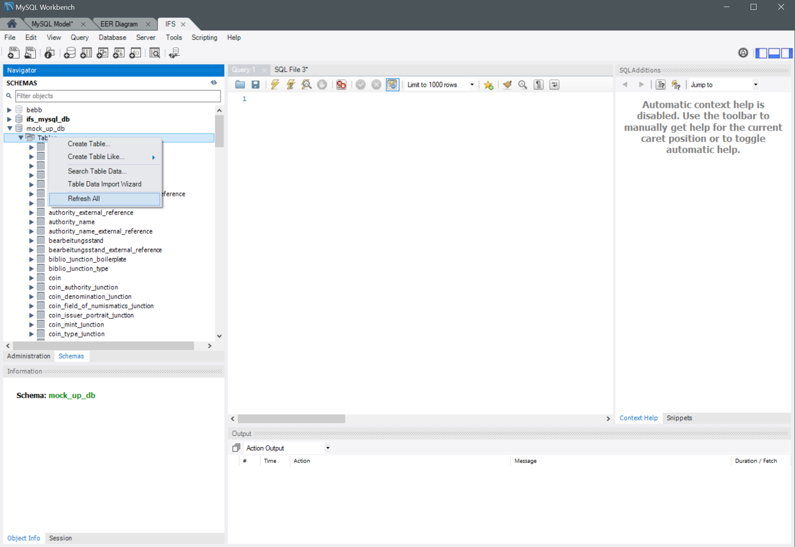
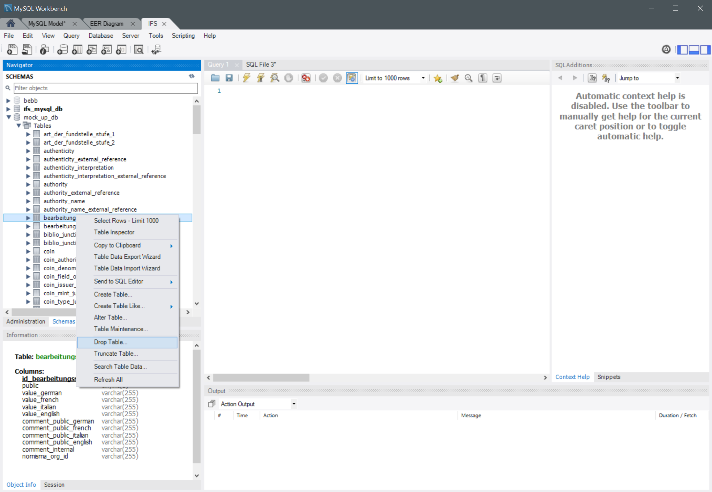

# Using the MySQL Workbench to Generate the ER-Diagram and managing the Tables

## Generating the ER-Diagram using the MySQL Workbench 

### 1.
Menu -> Database -> Reverse Engineer...

 

### 2.
Check the settings and adjust if necesssary, then click 
- “Next” (Windows) 

- resp. “Continue” und Eingeben des root-Passwortes (Mac)

  

 

 

 

 

 

 

 

 

 

 

 

 

 

 

 

 

 

 

### 3.
Let it process, then click 
- “Next” (Windows) 

- resp. “Continue” (Mac)

  

 

 

 

 

 

 

 

 

 

 

 

 

 

 

 

 

 

 

### 4.
Choose the desired database by placing the check-mark, then clickt 
- “Next” (Windows) 

- resp. “Continue” and enter the root-password (Mac)

  

 

 

 

 

 

 

 

 

 

 

 

 

 

 

 

 

 

 

### 5.
Let it process, then click 
- “Next” (Windows) 
- resp. “Continue” (Mac)

 

 

 

 

 

 

 

 

 

 

 

 

 

 

 

 

 

 

### 6.
Confirm the selection and place the check-mark for “Place imported objects on a diagram”, then click “Execute”

 

 

 

 

 

 

 

 

 

 

 

 

 

 

 

 

 

 

### 7.
Let it process, then click
- “Next” (Windows) 
- resp. “Continue” (Mac)

 

 

 

 

 

 

 

 

 

 

 

 

 

 

 

 

 

 

### 8.
- “Finish” (Windows)
- “Close” (Mac)

 

 

 

 

 

 

 

 

 

 

 

 

 

 

 

 

 

 

### 9.
In the menu “Model” -> “Object Notation” the choice is offered whether all attributes or just a reduced list (PK = Primary Keys, FK= Foreign Keys) should be shown. 

The menu “Diagram Properties and Size…” offers the option to set the size of the diagram (number of A4-sheets per width and height)

 

 

 

 

 

 

 

 

 

 

 

 

 

 

 

 

 

 

 

 

 

 

 

 

 

 

## Tables in the Database

If, for instance, in the python main-script the drop-tables functions only are run, and it is desired to see the current state of the database in the MySQL Workbench, that display has to be updated.  

By opening the Connection “IFS” the mock_up_db can be found within the Schemas-list.

 

 

 

 

 

 

 

 

 

 

 

 

 

 

 

 

 

 

 

 

 

 

By right-clicking “Tables” a menu opens. By clicking “Refresh All” the current state is loaded.

 

 

 

 

 

 

 

 

 

 

 

 

 

 

 

 

 

 

 

 

 

 

 

 

 

 

 

 

 

If all tables have been dropped “Refresh ALL” should lead to an empty tables list.

If there are still tables left the reason might be that at some point a table was renamed and the drop-tables function doesn’t hold the instruction to drop the table of the old name anymore. If that happens the remaining tables can be dropped manually by right-clicking and choosing “Drop Table…” in the opened menu.

