# How to install the IFS mock-up MySQL Database

 

## Purpose

The scripts in this repository can be used to create the IFS mock-up MySQL database and all tables within this database. This is work in progress (about 170 of the planned 210 tables are already included), but only minor tables are still missing.

 

## Requirements
The following programs need to be installed on your computer in order to run the scripts properly:

- [Python](https://www.python.org/downloads/) 3.8 or higher
- [MySQL community server](https://dev.mysql.com/downloads/mysql/) 
- Python module: mysql.connector-python

For the installation of *mysql.connector-python* we recommend using pip3, running the following from the command line:

`pip3 install mysql.connector-python`

Furthermore, we recommend using the [MySQL Workbench](https://dev.mysql.com/downloads/workbench/) to make the necessary local configurations.

In the Python scripts the connector uses the following configuration:
- `host="localhost"`
- `user="IFS"`
- `password="IFS_pw"`
- `database="Mock_up_DB"`  

## Create connection IFS and user IFS

When you open MySQL Workbench for the first time, your window should look like this:

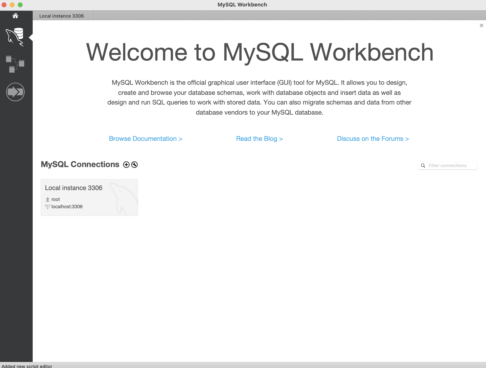

You then have to connect to your MySQL Server. You need to enter the root password which you chose during the installation process of *MySQL community server*.

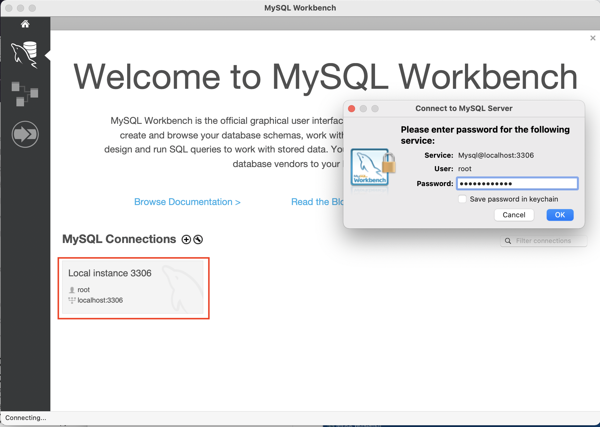

If this works properly, go back to the home menu (click on the home button on the top left). Click on the plus sign icon next to *MySQL Connections* and add a connection named *IFS*:

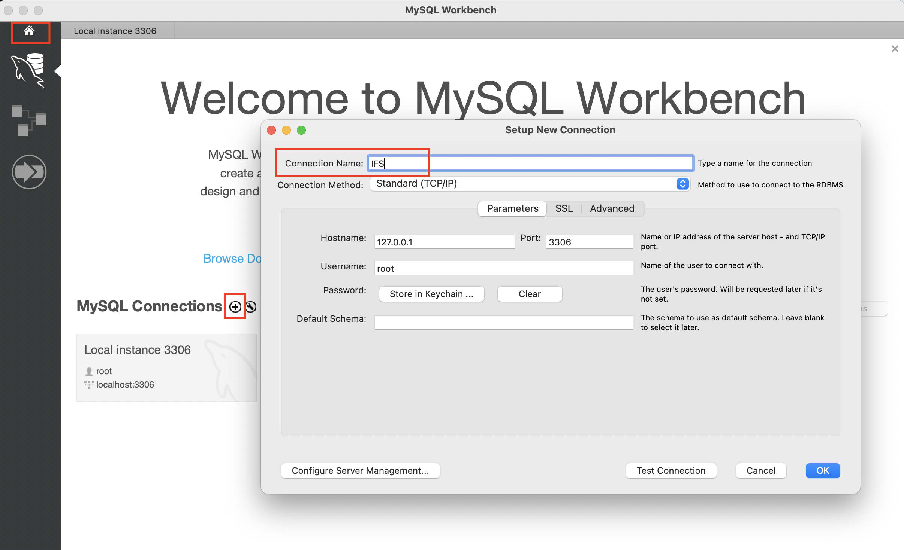

Afterwards, connect to *IFS* using your user root for login.

After having successfully connected to your server, your window should look like in the following image. Click *Users and Privileges* and then *Add Account*:

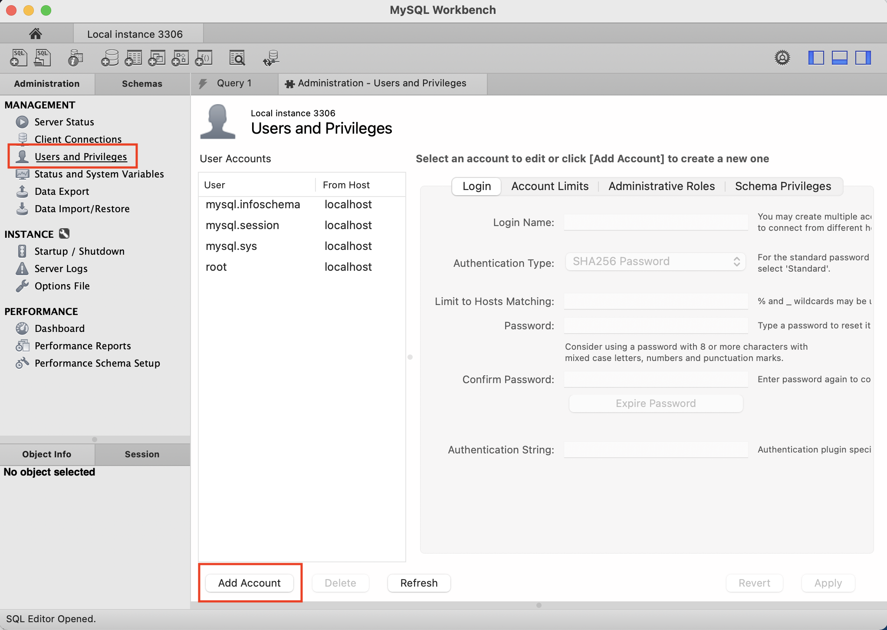

Add a user *IFS* with password *IFS_pw*:

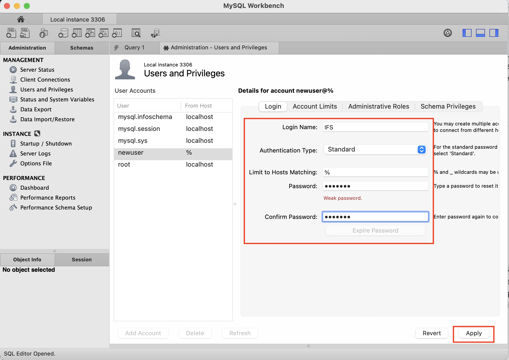

 

## Create database Mock-up-DB

Click on *SQL+* or the *Administration* tab:

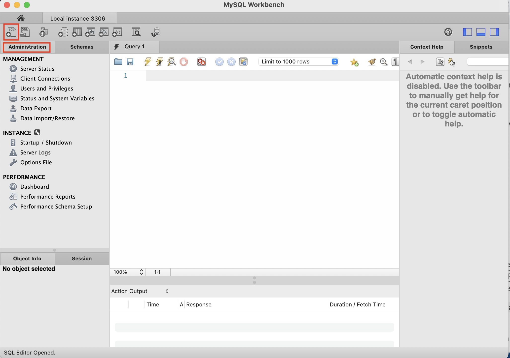

Enter on the command line `CREATE DATABASE Mock-up-DB` and hit enter. 

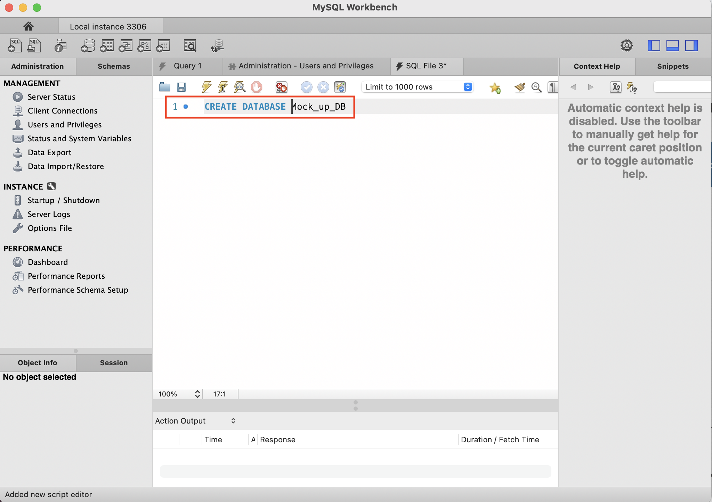

Now the database is created and your user *IFS* exists. You still have to provide your user with the necessary permissions to create and drop tables with the python scripts.

## Set permissions for user IFS

Click on tab *Administration*, select *Users and Privileges*, then the user *IFS* und click on tab *Schema Privileges*:

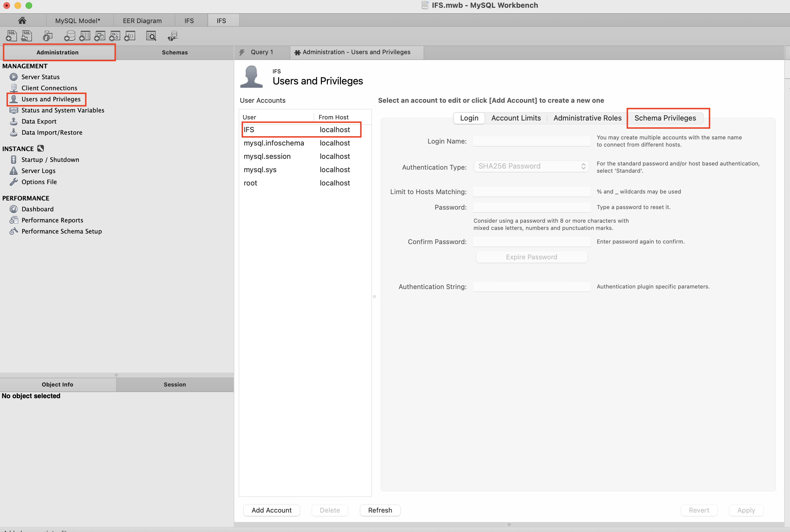

Select the schema for which you want to grant user *IFS* all permissions:

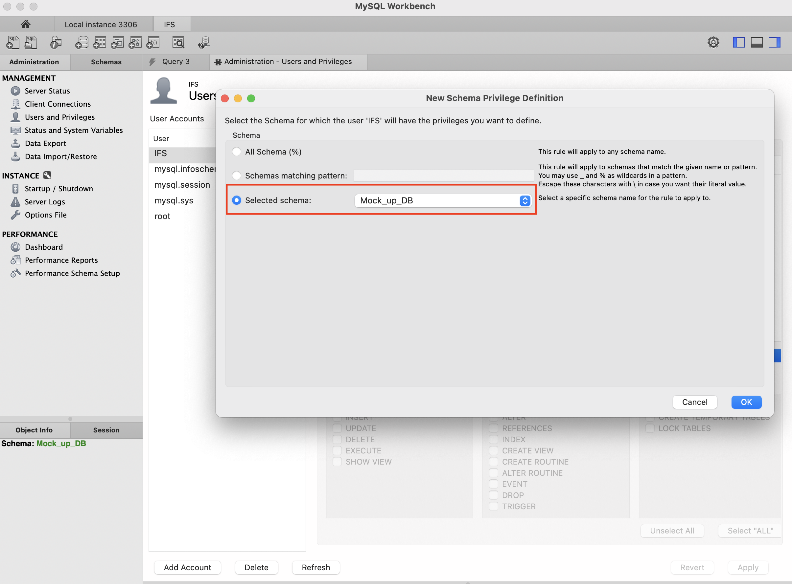

Click *Select all* and then *Apply*:

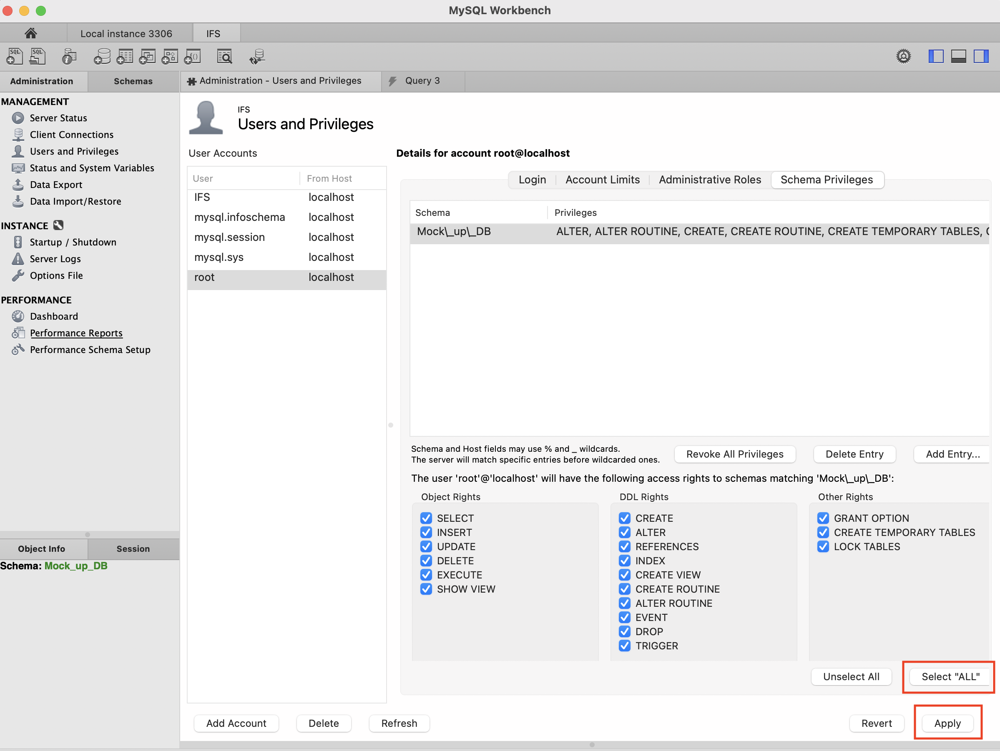

Now change to the tab *Administrative Roles* and grant *DBA* on top which will automatically select everything else, then hit *Apply*:

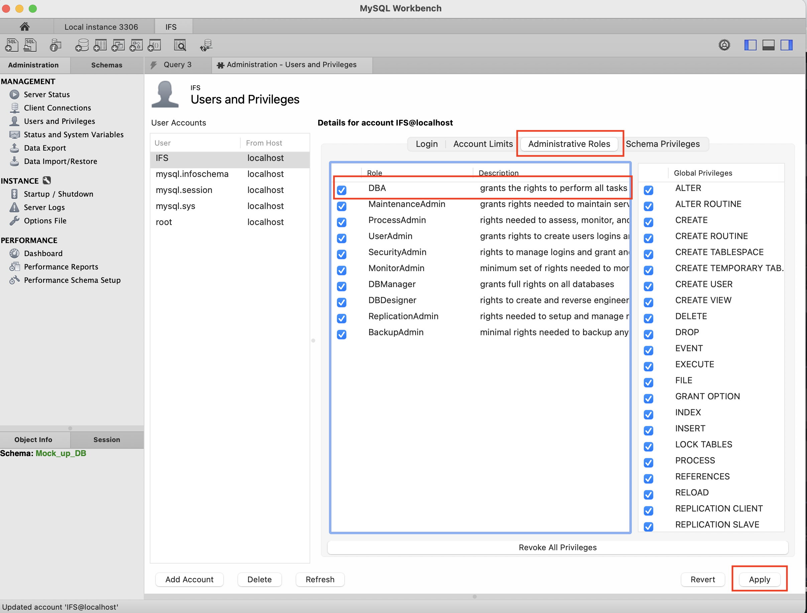

 

## Run python scripts

Now you are ready to create the tables of the database with the python scripts. Change to folder *IFS_DB_project/Mock_up_data_modeling* and run the script *main_mock_up_db.py*: 

`python3 main_mock_up_db.py`

This will create all tables of the database. 

How you can visualize the data model in MySQL Workbench is explained in  the document [*ER-Diagram MySQL Workbench.pdf*](https://github.com/IFS-ITMS-IRMS/SICF_MySQL/blob/main/Documentation/Generate-ER-Diagram/Generate_ER_Diagram.pdf).

 

## Trouble shooting on MacOS

If you receive an error message such as

`ERROR 1045 (28000): Access denied for user ...`

when trying to create the tables on MacOS, you can try whether a simple stopping and re-starting of the MySQL Server in the system settings solves the problem.

If this does not help, it may be necessary to go to the system settings and hit the *Initialize Database* button:

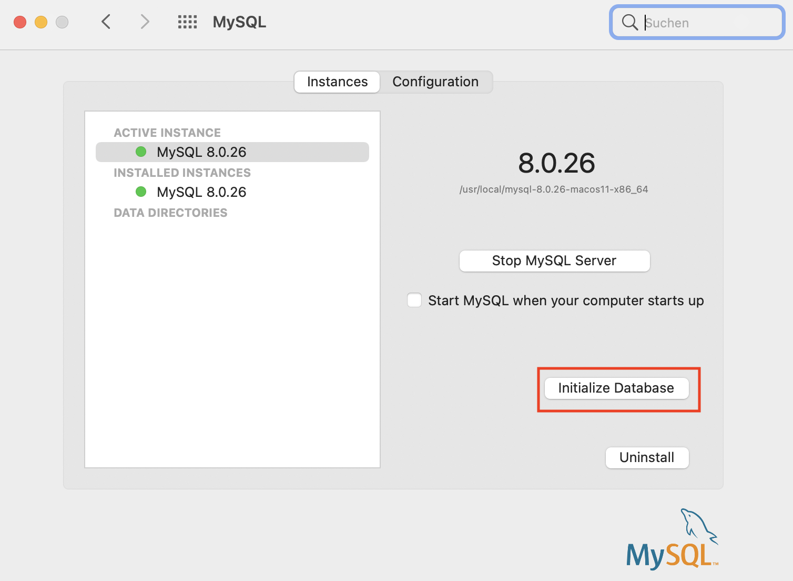

Enter a password for your *root* user - it may be the same which you used before - in the pop-up window and click *OK*. Then you have to enter your MacOS password and to click *OK* once more.

In a terminal window, change to the folder */usr/local/mysql/bin*.

There, type `mysql -u root -p [your password here]`

 Afterwards it may be necessary to create your user and project again.

